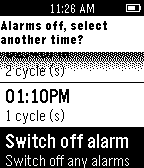

# Sleepyti.me for Pebble
*Say good-bye to groggy mornings*

Sleepyti.me is based on David Shaws wonderful [Sleepyti.me web app](https://github.com/davidshaw/sleepyti.me) at http://sleepyti.me. The motivation for this app was the need to learn C and the want to make a pebble app. 

